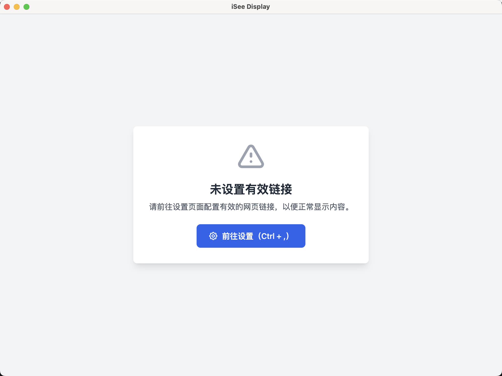
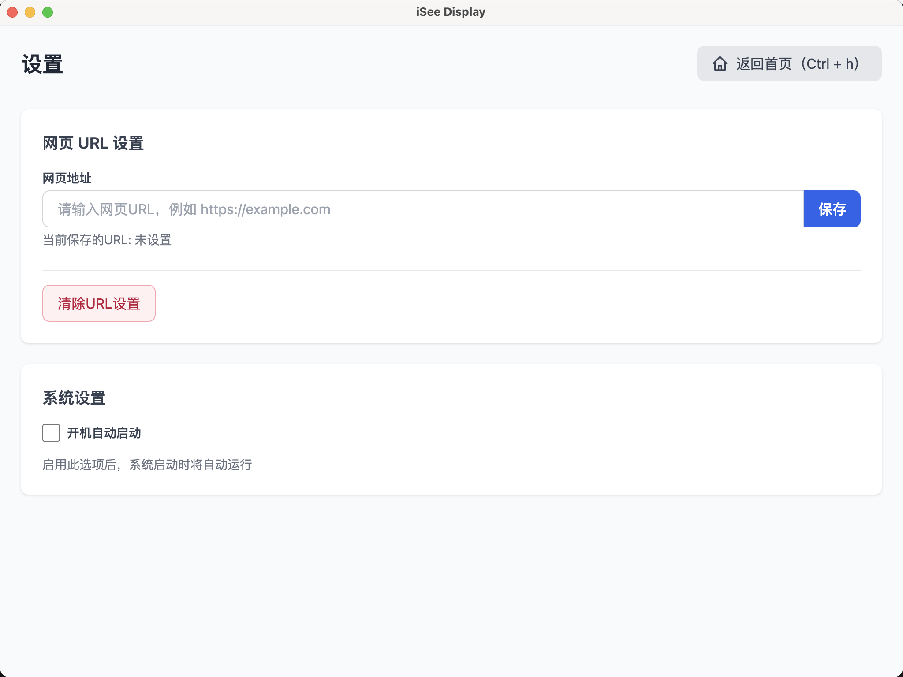

# iSee 浏览器




一个用于展示自定义网页 `Electron` 应用，不使用 `Tauri` 或 `Wails` 的原因是内置 `Webview` 加载网页会有兼容性问题。默认启动全屏，不需要可自行修改 `fullscreen: false`

- [x] 开机自启
- [x] 切换全屏
- [x] 刷新按钮
- [x] 全局快捷键
- [x] 跨平台

## 安装依赖

```bash
npm install
```

## 运行

```bash
# 首次
npm run postinstall

npm run dev
```

## 打包

```bash
# 其它见 package.json
npm run build:win
```

## Author

ChenZhaoYu
